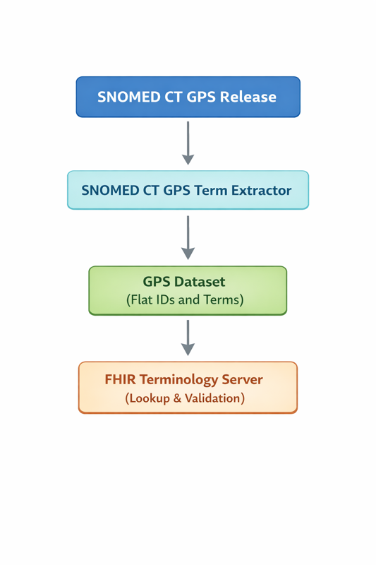

# Use of the Global Patient Set in a FHIR Terminology Server

The Global Patient Set (GPS) may be used as a content source for a FHIR terminology server in environments where licensed access to the full SNOMED CT release is not available. In such configurations, the GPS supports identifier-level terminology services only and must not be treated as a substitute for a full SNOMED CT terminology server.

GPS content used by a terminology server is typically prepared in advance from SNOMED CT RF2 releases using tooling such as the SNOMED CT GPS Term Extractor, which derives a flat, GPS-compatible dataset suitable for loading into terminology services.

<figure><figcaption>
This diagram illustrates how the Global Patient Set is prepared and used within a FHIR terminology server. The SNOMED CT GPS Release provides the source content, which is processed by the SNOMED CT GPS Term Extractor to generate a simplified GPS dataset containing only concept identifiers and terms. This flat dataset is then loaded into the FHIR terminology server, where it supports identifier-level operations such as code lookup and validation, without exposing SNOMED CT semantic or hierarchical functionality.
</figcaption></figure>

## &#x20;Supported Terminology Server Capabilities

When configured with GPS-derived content, a FHIR terminology server may support a limited set of operations that rely solely on identifiers and human-readable terms, including:

* `$lookup` for SNOMED CT concept identifiers
* `$validate-code` to confirm identifier validity and active status

Responses are limited to concept identifiers and associated term information and must not include semantic relationships, hierarchies, or inferred data.

## Capabilities Not Supported Using the GPS

A FHIR terminology server configured with the GPS must not support terminology services that require access to SNOMED CT semantics.

This includes, but is not limited to:

* subsumption testing
* hierarchical navigation or expansion
* $expand operations based on SNOMED CT hierarchies
* use of Expression Constraint Language (ECL)
* semantic value set expansion
* reasoning or inference

All such capabilities require licensed access to the full SNOMED CT release.

